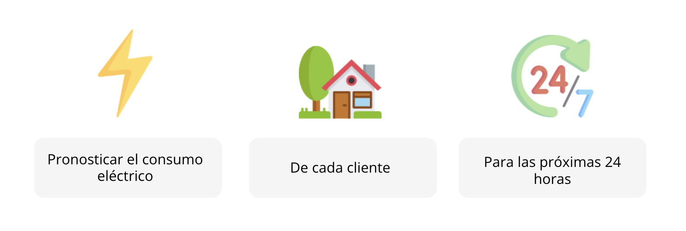

# Forecasting & Fine Tuning

Bienvenidos a este pequeño módulo práctico de Deep Learning. Dentro de este repositorio encontrarán una pequeña introducción sobre pronósticos de Series de Tiempo utilizando Redes Neuronales y un ejemplo práctico de cómo realizar Fine Tuning en modelos de imágenes. 

Juan Eduardo Coba Puerto 

## Forecasting

Dentro de la carpeta de `Forecasting` encontrarás lo necesario para el taller de pronósticos. En este módulo realizaremos un modelo que nos permita hacer Single-Shot Forecasts con un horizonte de tiempo grande y para un conjunto de individuos. Son pronósticos de múltiples series a horizonte completo. 

Los notebooks que encontrarás allá son: 
- `Forecasting Example.ipynb` con una guía sobre cómo hacer un pronóstico multi-step para múltiples series usando LSTM
- `[HANDS ON] Pronóstico Probabilístico.ipynb` un ejercicio práctico para hacer un pronóstico de este estilo, ¡pero volviéndolo probabilístico! Es decir, prediciendo una distribución de probabilidad. 
- `Pronóstico Probabilístico.ipynb` La solución al ejercicio práctico 

## Computer Vision

En este apartado utilizaremos un ejemplo de TensorFlow [https://www.tensorflow.org/tutorials/images/transfer_learning] para ver en acción cómo se puede utilizar Transfer Learning y Fine Tuning para aprovechar modelos pre-entrenados y usarlos en nuestros propios problemas de clasificación. Discutiremos sobre algunas implicaciones prácticas, mientras construimos un clasificador que distinga entre perros y gatos.